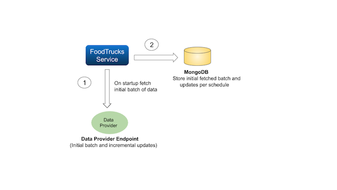
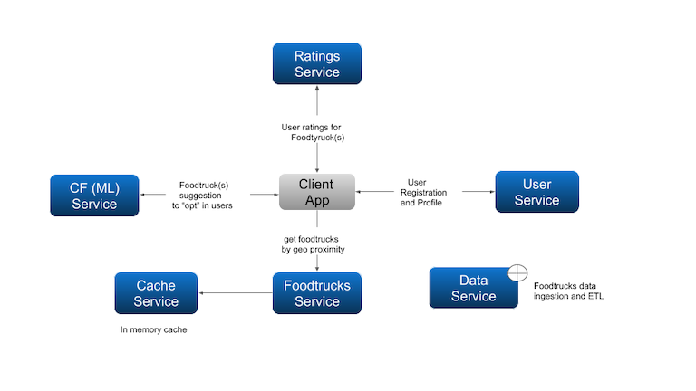

# Problem Statement:
The following project is a proposed solution approach and consideration items for a Food Truck Service Locator in San Francisco city.

The main use cases being:

1. Find a food truck no matter where our work takes us in the city of SF.
2. Provide at least 5 food trucks to choose from a particular latitude and longitude.

# Solution Overview

The solution architecture leverages microservices design pattern to facilitate
decoupling of functional context, ease of scalability and maintainability

The first iteration of the solution aims to provide an example 
implementation comprised of a single service (FoodTrucks Service)


The **Potential Functional Enhancements** section illustrates potential additional
services that can complement the FoodTrucks service.

## Rationale for storing data to mongodb

1. Easily augment the data schema with additional data collections such as user reviews and ratings.

2. Baked in [$nearSphere](https://docs.mongodb.com/manual/reference/operator/query/nearSphere/) operator 
to calculate "nearest" to a given location (latitude and longitude)

3. Acts as fall back repository in the event the data service provider is unavailable
      
4. Provides a very fast bulk write - With an unordered list of operations, MongoDB can execute 
the operations.

5. Provides text search functionality to query food items.


## FoodTrucks Service REST API

The following OpenApi documents the current [FoodTrucks Service REST API](https://app.swaggerhub.com/apis/nboumaza/foodtrucks/1.0.1)


## Implementation Framework (Micronaut) Overview

[Micronaut](<https://micronaut.io/) is a modern, JVM based, full-stack framework for building modular, easily testable microservice applications. 
It integrates cloud technologies into the framework, and microservice patterns such as service discovery, 
distributed tracing, circuit breaker, fallback service hooks, API versioning and many others baked into the framework -:)


# Building and Running Steps

### Prerequisite:

Java 8 (or 9)

Note: A Gradle wrapper is provides in the project. You can alternatively use your own distribution.

## Building

1. Clone this repo and change
```
git clone https://github.com/nboumaza/foodies.git
```

2. Build foodtrucks artifact
```
./gradlew build
```
## Running 

3. At the root of the project locate the file named **local-compose.yml**:
It orchestrates 3 container services: MongoDB, Consul and Zipkin.
Issue the following command to start the your local runtime stack (in non detached
mode if you'd like to keep an eye on the runtime info)
```
docker-compose -f local-compose.yml up
```
Note: to stop the service you use the following commands:
```
docker-compose -f local-compose.yml down
```
4. Once you stack is up and running, start the foodtrucks service:
From the root folder of the project, run the following command:

```
./gradlew run
```
or
```
java -jar ./build/libs/*-all.jar
```

## Endpoints Info

* FoodTrucks: http://localhost:7070/foodtrucks

* ZipKin: http://localhost:9411

* Consul: http://localhost:8500

## If it was not already 12:00 AM what would I do...?

1. Beef up unit tests

2. Enhance error handling of controllers

3. Beef up Operational Observibility: 

    2.1.Configure Zipkin to use Prometheus and Grafana
    
    2.2 Update local-compose.yml accordingly
    
    2.3 Add instrumentation to FoodTruckController to observe runtime behavior with a stress test
     
4. CI/CD via Kubernetes 
    
    4.1 Test out the included yml files under kubernetes
    
    4.2 Update the doc

# Potential Functional Enhancements

1. Foodtrucks Service Updated with the added functionality. 

2. User Service: user registration and opt in disclosure of foodies preferences (vegan/meat lover/ ...etc)

3. CF Service: Uses Collaborative Filtering to predict the likelihood a user would like foodtruck(s) liked by other users 
that share same ratings for same type of food.  (relies on trained ML algorithm  )

4. Rating Service:  ratings for a foodtruck. Either retrieved from a third party rating 
service (Yelp etc..) or directly through the client app

5. Data Service: Scheduled service that launches foodtrucks data ingestion and updates retrieved from a given Data Source service. (SFGov.org, etc..)
This service is used by the foodtrucks service. 
A FaaS can trigger every “midnight” (for the given timezone of the foodtrucks service) to start a batch job for
data refresh.

6. In memory cache (memcached or redis) which stores TTL based foodtrucks data 